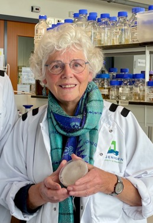

# OMGN 2024

OMGN 2024 will be held immediately before the [32nd Fungal Genetics
Conference](https://genetics-gsa.org/fungal-2024/)

## Location

Asilomar Conference Grounds Pacific Grove, CA, United States
93950. For more travel information, please refer to
<https://genetics-gsa.org/fungal-2024/hotel-and-travel/>

## Meeting dates

Full day on Sunday (March 10) and Monday (March 11), until noon on
Tuesday (March 12).

## On-site hotel accommodations

Single Occupancy: \$327.27/night

Double Occupancy: \$218.01/night

This includes breakfast/lunch/dinner throughout your stay, starting with
dinner on the day of arrival and ending with lunch on day of departure.

It is important to stay onsite as this will offset part of the costs on
meeting rooms and equipment. **Staying onsite at Asilomar Conference
Grounds for at least 2 nights is required** for the meeting
registration except for local people who do not need hotel
accommodation.

Link to on-site hotel booking: <https://book.passkey.com/e/50748057>

## Abstract submission

Submit through the registration form below. Word limits: 250 words. **Deadline: Feb 10, 2024**

## Registration

Registration is via the form below (or [click here](https://docs.google.com/forms/d/e/1FAIpQLSeFyxrSSeYzewDLkJqDJnNTZ-Fpc9LaTqzIbbS1y0s_mdDQ5w/viewform)).

<iframe src="https://docs.google.com/forms/d/e/1FAIpQLSeFyxrSSeYzewDLkJqDJnNTZ-Fpc9LaTqzIbbS1y0s_mdDQ5w/viewform?embedded=true" width="640" height="1199" frameborder="0" marginheight="0" marginwidth="0">Loading registration form…</iframe>

Registration fee: \$350USD for PIs, \$250USD for postdoctoral researchers and
graduate students

It will cover coffee breaks, banquet, audio and visual equipment, and conference rooms.

Registration requirement: **Staying onsite at Asilomar Conference
Grounds for at least 2 nights is required for the meeting
registration** except for local people who do not need hotel
accommodation.

Registration deadline:

- **Presenter registration deadline, Feb 10, 2024**
- **General registration deadline, Feb 25, 2024**

Payment will occur via paypal, direct to Paul Morris <pmorris@bgsu.edu> or via the payment link <https://paypal.me/OMGN2024>. Please send your registration fee to Paul, and he will provide an invoice (see above: \$350 for PIs, \$250 for postdocs & grad students).

In case of any issues with registration, or for any details not covered on this page, please contact the conference organisers:

- Patricia Manosalva (<patricia.manosalva@ucr.edu>)
- Paul Morris (<pmorris@bgsu.edu>)
- Miaoying Tian (<mtian@uga.edu>)

## Visa Letter of invitation

Please send the request to <pmorris@bgsu.edu> with Letter of Invitation for Visa Application in the subject line.

## Invited Speakers

### Oomycete pioneer talk

Honoring career long oomycete research and service to the community

Dr. Francine Govers, University of Wageningen

Title of the talk: O-o-my-career, looking back with cheer.

### FungiDB

Dr. Evelina Basenko (Evelina.Basenko@liverpool.ac.uk), [FungiDB](https://fungidb.org)
Scientific Outreach & Education Specialist, will present a talk and a
poster to demonstrate FungiDB\'s functionalities and tools, or other
activities of interest to the community.
